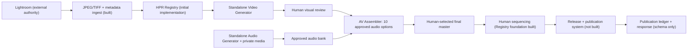

# HPR Umbrella

HPR Umbrella is the custom production system for [How People Relate](https://danielg805.sg-host.com/)(Temp page for future dannygoldfield.com site), a daily series of seven-, nine-, and eleven-second looping portrait videos by photographer Danny Goldfield.

The system automates repetitive production steps while leaving portrait
selection, development behavior, timing, sound, sequencing, and final approval
to the artist.

> **Design principle:** Automate everything except taste.

## Why it exists

How People Relate draws from an archive of many thousands of photographs. Publishing a carefully considered video every day requires a system that can generate possibilities without pretending to make artistic judgments.

HPR Umbrella is centered on an operational Registry, a Candidate Engine and AV
Assembler, and two separately versioned media generators:

| Component | Responsibility | Does not decide |
| --- | --- | --- |
| [HPR Registry](components/registry/) | Preserves portrait identities and revisions, candidates, reviews, final masters, sequence versions, and publication state | The final sequence or any artistic selection |
| [Candidate Engine and AV Assembler](components/candidate-generator/) | Plans finite option sets and combines selected visuals with human-approved audio | Which candidate becomes the published work |
| [Standalone Audio Generator](https://github.com/dannygoldfield/HPR-Audio-Generator) | Builds reproducible, loop-ready soundtracks and maintains the Ingredient Audit | Which soundtrack is right |
| [Standalone Video Generator](https://github.com/dannygoldfield/HPR-Video-Generator) | Builds silent, loop-safe fixed-geometry portrait-development videos | Which surface behavior best serves a portrait |
| [Review interface](components/review-interface/) | Plays candidates and writes human ratings, rejection, notes, and selections directly to the Registry | Whether a candidate is artistically successful |
| Text Plugin | Adds optional nondestructive identity treatments after a pair is selected | Whether text is needed for a channel |

`config/component-lock.json` pins the exact generator repositories and commits.
`tools/verify_production/verify_production.py` is the production gate. Umbrella
does not contain a second copy of either generator.

## How the system works



Each candidate can be recreated from its portrait, duration, presets, recipes, generator versions, and random seed. The system generates constrained variation; Danny listens, looks, compares, and selects.

## Current status

- **Audio Generator:** the standalone `HPR-Audio-Generator` repository is
  canonical and protected by an exact commit lock.
- **Video Generator:** the standalone `HPR-Video-Generator` repository is
  canonical and protected by an exact commit lock. Legacy camera-motion and White Balance prototypes remain
  reproducible. `PDE-002` is the locked Development Animation; Infinity adds
  the locked `IBN-001` static, portrait-unique number background. Film grain was evaluated
  through multiple visibility, motion, source, and opacity comparisons and was
  rejected as a production layer on 2026-08-21. Shipping visuals contain no
  film grain. All registered test visuals remain reproducible as research
  history.
- **HPR Registry:** initial SQLite implementation ingests unsequenced Lightroom exports, preserves portrait revisions and metadata provenance, and assigns episode numbers only when an approved-master sequence is locked.
- **Candidate Engine:** implements the earlier 120-slot archive dry-run planner, separate Audio/Visual/Pair/Publishing banks, deterministic option sets, independent component review fields, and replaceable photo sources. Its early `EpisodeRecord` model is legacy and must be integrated with the Registry before production planning.
- **Human review:** the local screen reviews visuals and complete visual/audio
  pairs. The current production pairing round combines the locked NYChildren
  visual with 10 distinct, native 11-second `AR-011` candidates. Each combines
  an ambient bed, one tactile gesture, and one prepared Suno stem; the
  low-discontinuity source excerpt and two-second equal-power overlap reduce
  audible loop transitions. It
  records audio and pair ratings separately, keeps unused audio banked
  automatically, and retires the audio only when its pair is selected or the
  reviewer explicitly retires it. White Balance candidates add
  exact frame-synchronized Temperature and Tint references outside the
  image-only video. Development candidates add a synchronized final-image
  reveal reference and local spatial range. Artistic decisions remain outside
  automation.
- **Text Plugin:** deferred until selected audio-video masters are ready.
- **Now mode:** explicitly deferred; the archive workflow is the production focus.

Portraits, licensed audio, generated videos, workbooks, and private production data are intentionally excluded from this public repository.

## Repository layout

```text
components/
  registry/
  review-interface/
  candidate-generator/  # Candidate Engine and AV Assembler
config/
  component-lock.json
  approved-visual-baseline.json
tools/
  verify_production/
  inspect_metadata/
  render_motion_pilot/
  render_white_balance_pilot/
  render_film_grain_test/
  render_pair_pilot/
docs/
  architecture.md
  creative-principles.md
  workflow.md
examples/
  candidate-manifest.example.json
```

## Plan a batch

The Candidate Engine can plan deterministic outputs without access to private media:

```bash
python -m hpr_candidate_generator.cli plan \
  --portrait workspace/portraits/example.tif \
  --grain workspace/grain/filmgrain.mov \
  --duration 9 \
  --video-preset VP-012 \
  --audio-recipe AR-009 \
  --seed 2026080201 \
  --count 3
```

Production rendering requires Python 3.11 or newer, FFmpeg, and the locally
managed portrait and licensed audio libraries. The grain library is required
only to reproduce completed research tests. See [Workflow](docs/workflow.md)
for setup and use.

## Legacy 120-slot dry run

Prepare a CSV with `portrait_id,path` columns and exactly 120 selected portraits, then run:

```bash
hpr-candidate archive-plan \
  --portraits-csv workspace/archive-portraits.csv \
  --seed 2026080601 \
  --output workspace/archive-production
```

This command reflects the earlier slot-first model. It remains useful for code
inspection but must not be treated as the production episode order. Production
intake now begins in the Registry, and episode numbers are assigned only after
approved videos are sequenced.

## Documentation

- [Architecture](docs/architecture.md)
- [Creative principles](docs/creative-principles.md)
- [Production workflow](docs/workflow.md)
- [Lightroom JPEG metadata contract](docs/metadata-contract.md)
- [Three-portrait pilot report](docs/pilot-report-2026-08-14.md)
- [Motion Rhythm specification](https://github.com/dannygoldfield/HPR-Video-Generator/blob/main/docs/MOTION-RHYTHM.md)
- [White Balance animation specification](https://github.com/dannygoldfield/HPR-Video-Generator/blob/main/docs/WHITE-BALANCE-ANIMATION.md)
- [Portrait Development Animation specification](https://github.com/dannygoldfield/HPR-Video-Generator/blob/main/docs/PORTRAIT-DEVELOPMENT-ANIMATION.md)
- [Film Grain Animation research record](https://github.com/dannygoldfield/HPR-Video-Generator/blob/main/docs/FILM-GRAIN-ANIMATION.md)
- [Local review interface](components/review-interface/)
- [HPR Registry](components/registry/)
- [Danny Goldfield’s portrait projects](https://dannygoldfield.com/)

## Rights

Copyright © 2026 Danny Goldfield. All rights reserved. Source portraits, licensed audio, and generated media are not distributed with this repository.
