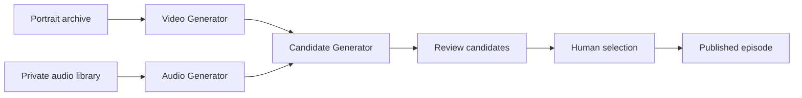

# HPR Umbrella

HPR Umbrella is the custom production system for [How People Relate](https://danielg805.sg-host.com/)(Temp page for future dannygoldfield.com site), a daily series of seven-, nine-, and eleven-second looping portrait videos by photographer Danny Goldfield.

The system automates repetitive production steps while leaving portrait selection, movement, timing, sound, sequencing, and final approval to the artist.

> **Design principle:** Automate everything except taste.

## Why it exists

How People Relate draws from an archive of hundreds of thousands of photographs. Publishing a carefully considered video every day requires a system that can generate possibilities without pretending to make artistic judgments.

HPR Umbrella separates that work into three focused components:

| Component | Responsibility | Does not decide |
| --- | --- | --- |
| [Audio Generator](components/audio-generator/) | Builds reproducible, loop-ready soundtracks from constrained recipes | Which soundtrack is right |
| [Video Generator](components/video-generator/) | Builds silent, loop-safe vertical videos from portrait photographs | Which movement best serves a portrait |
| [Candidate Generator](components/candidate-generator/) | Coordinates audio and video, creates review candidates, and records provenance | Which candidate becomes the published work |

## How the system works



Each candidate can be recreated from its portrait, duration, presets, recipes, generator versions, and random seed. The system generates constrained variation; Danny listens, looks, compares, and selects.

## Current status

- **Audio Generator:** implemented with deterministic recipes for 7-, 9-, and 11-second loops.
- **Video Generator:** implemented with 31 loop-safe motion presets for 1080 × 1920 video.
- **Candidate Generator:** implemented for deterministic batch planning, coordinated generation, audio/video assembly, and JSON provenance manifests.
- **Human review:** deliberately remains outside the automated decision path.
- **Text Generator:** excluded from this version of the Umbrella.

Portraits, licensed audio, generated videos, workbooks, and private production data are intentionally excluded from this public repository.

## Repository layout

```text
components/
  audio-generator/
  video-generator/
  candidate-generator/
docs/
  architecture.md
  creative-principles.md
  workflow.md
examples/
  candidate-manifest.example.json
```

## Plan a batch

The Candidate Generator can plan deterministic outputs without access to private media:

```bash
python -m hpr_candidate_generator.cli plan \
  --portrait workspace/portraits/example.tif \
  --grain workspace/grain/filmgrain.mov \
  --duration 9 \
  --video-preset VP-012 \
  --audio-recipe AR-009 \
  --seed 2026080201 \
  --count 3
```

Production rendering requires Python 3.11 or newer, FFmpeg, and the locally managed portrait, grain, and licensed audio libraries. See [Workflow](docs/workflow.md) for setup and use.

## Documentation

- [Architecture](docs/architecture.md)
- [Creative principles](docs/creative-principles.md)
- [Production workflow](docs/workflow.md)
- [Danny Goldfield’s portrait projects](https://dannygoldfield.com/)

## Rights

Copyright © 2026 Danny Goldfield. All rights reserved. Source portraits, licensed audio, and generated media are not distributed with this repository.
